<!-- Gerado por gerar.mjs a partir de perfil.config.mjs. Edite o config, não este arquivo. -->

<picture><source media="(prefers-color-scheme: dark)" srcset="assets/banner-escuro.svg"></picture>

<a href="https://github.com/luancatheringer/luancatheringer/blob/main/portfolio.md#plataforma-para-marketplace"><picture><source media="(prefers-color-scheme: dark)" srcset="assets/destaque-escuro.svg"></picture></a>

<picture><source media="(prefers-color-scheme: dark)" srcset="assets/secao-projetos-escuro.svg"></picture>

<a href="https://github.com/luancatheringer/luancatheringer/blob/main/portfolio.md#pedido-b2b-no-erp-certo"><picture><source media="(prefers-color-scheme: dark)" srcset="assets/projeto-pedido-b2b-no-erp-certo-escuro.svg"></picture></a>

<a href="https://github.com/luancatheringer/luancatheringer/blob/main/portfolio.md#lead-direto-no-whatsapp"><picture><source media="(prefers-color-scheme: dark)" srcset="assets/projeto-lead-direto-no-whatsapp-escuro.svg"></picture></a>

<a href="https://github.com/luancatheringer/luancatheringer/blob/main/portfolio.md#rastreio-contra-chargeback"><picture><source media="(prefers-color-scheme: dark)" srcset="assets/projeto-rastreio-contra-chargeback-escuro.svg"></picture></a>

<a href="https://github.com/luancatheringer/luancatheringer/blob/main/portfolio.md"><picture><source media="(prefers-color-scheme: dark)" srcset="assets/botao-portfolio-escuro.svg"></picture></a>

<a href="https://instagram.com/lcautomacoes.ai"><picture><source media="(prefers-color-scheme: dark)" srcset="assets/fim-escuro.svg"></picture></a>

