<!-- Gerado por gerar.mjs a partir de curriculo.config.mjs. Edite o config, não este arquivo. -->

**Gestor de automação · integrações por API, IA e sistemas sob medida**  
Belo Horizonte, MG · [@lcautomacoes.ai](https://instagram.com/lcautomacoes.ai) · [github.com/luancatheringer](https://github.com/luancatheringer)

## Resumo

Sou gestor de automação. Não venho da programação: construo com IA, no que hoje se chama vibe coding. Descrevo o que precisa ser feito, o Claude escreve o código comigo e eu testo, ajusto e coloco no ar. É assim que conecto ERP, CRM, WhatsApp, marketplace e e-commerce por API e webhook, monto painéis com dados ao vivo e crio rotinas de controle. Todo fluxo passa por homologação, com teste de ponta a ponta antes de ligar, e segue acompanhado depois que entra em produção.

## Experiência

### Sistemas

- **Plataforma para marketplace.** Sistema web feito do zero com IA e usado no dia a dia da equipe: vendas ao vivo e por período com a apresentação gerada em um clique, política de preço com régua de revendedores, margem real por anúncio, proteção de marca, promoções, SAC com perguntas e pós-venda, avisos automáticos, chat e chamadas de vídeo da equipe e login com verificação em duas etapas. Mais de 500 atualizações em cinco semanas. Claude (vibe coding) · Next.js · Supabase · Cloudflare · WebRTC · Claude API

### Integrações por API

- **Pedido B2B no ERP certo.** Integração entre o CRM de vendas e o ERP que fatura cada pedido pela empresa escolhida pelo vendedor, com as parcelas de todas as condições de pagamento, a tradução dos códigos de produto entre as contas, as observações do pedido e uma trava contra duplicidade. Homologada e em produção, convivendo com a integração nativa, sem erro nas primeiras execuções.
- **Lead direto no WhatsApp.** Cada lead da landing page vira contato, card no funil e primeira mensagem no WhatsApp, já com o vendedor da região. Em uso desde julho, com erro em menos de 0,2% das execuções. Uma segunda landing page ganhou fluxo e funil próprios, sem mexer no primeiro.
- **Troca da ferramenta de marketing sem perder captação.** Webhook em XML, telefone padronizado e origem do lead reconstruída pelas UTMs, reaproveitando o direcionamento por região. Pronto e testado de ponta a ponta.
- **Leads recuperados pelo webhook.** Leads que saíram da fila de processamento voltaram ao fluxo reenviados pelo webhook, a partir da exportação da ferramenta de marketing, sem perda.
- **Relatórios direto da API.** Dados puxados das APIs do CRM de vendas e da plataforma de WhatsApp quando a tela do sistema não entrega o recorte que a gestão precisa.

### WhatsApp e atendimento

- **Triagem do WhatsApp comercial.** Chatbot com ordem fixa de verificação: horário, rotas especiais, contato que volta, região e menu só para quem é novo.
- **Entrada de campanha.** A frase do anúncio leva o contato a um fluxo próprio, que etiqueta, cria o card do gerente e transfere, sem card repetido.
- **Prospecção que vira card.** O vendedor aplica uma etiqueta e a oportunidade entra no funil sem duplicar. Zero erro nas execuções.
- **Listas de prospecção no funil.** A planilha do vendedor vira cards na etapa certa, sem duplicar, e separa quem não tem WhatsApp.
- **Campanha de primeira compra.** Disparos no WhatsApp separados por região e origem do contato, com relatório consolidado de entrega, leitura e interação.
- **Aviso de pedido enviado.** Oito modelos de mensagem aprovados pela Meta, um para cada transportadora, com botão de rastreio. Pronto e testado.

### Controles e prevenção de fraude

- **Alerta de compra suspeita.** O ERP avisa cada pedido novo do site e um porteiro na nuvem confere os padrões de fraude já conhecidos; só quando encontra algo ele aciona o fluxo, e o financeiro recebe no WhatsApp a classificação do risco, o motivo e um botão que abre o pedido. Dois pedidos de uma rede conhecida foram cancelados antes do envio, o segundo pelo alerta automático, no dia em que a próxima compra era esperada.
- **Rastreio contra chargeback.** Script que cruza a exportação da plataforma de pagamento com o ERP e devolve o código de rastreio dentro do prazo de defesa. Roda três vezes por semana e encontra de 95% a 97% dos pedidos.
- **Relatório de chargebacks.** Rodada semanal com uma base mestre que detecta reincidência e padrões de má-fé; a mesma base alimenta o alerta de compra suspeita.

### Relatórios e análises

- **Relatório comercial semanal.** Vendas do CRM e funil do WhatsApp num deck de layout fixo, toda semana.
- **Leitura do atendimento comercial.** Taxa de resposta por modelo de mensagem e pontos fortes e de atenção de cada vendedor.
- **Modelo de metas por vendedor.** Base do último trimestre e fator sazonal nos meses de baixa, gerado por script.
- **Tempo de atendimento nos marketplaces.** Diagnóstico do tempo de primeira resposta e das causas de venda com problema, com plano de meta.
- **Auditoria de preço de revendedores.** Anúncios comparados ao preço da loja oficial; o levantamento também encontrou uma marca falsa copiando o produto.
- **Auditoria do e-commerce.** Revisão completa de páginas, links, SEO e acessibilidade, entregue em listas priorizadas.

### Blog, conteúdo e documentos

- **Migração do blog sem perder busca orgânica.** Blog antigo levado para o WordPress: inventário de 1.299 links, redirecionamentos 301 no ar na plataforma da loja, pilotos antes de cada lote e 142 textos convertidos por script, com frase-chave e meta descrição de SEO, prontos para importar em lotes.
- **Onboarding em PDF preenchível.** Playbook de 24 páginas com 109 caixas de marcação e 43 campos de resposta, inseridos por script sem mexer na diagramação.

## Outros trabalhos

- CRM de prospecção regional: escopo e arquitetura de um CRM com mapa de lojistas, funil e assistente de IA.
- Agente de IA para mensagens do Instagram: triagem entre produto, pedido, parceria e influenciador.
- Fechamento mensal de comissão de influenciadores com IA, a partir da planilha exportada.
- Pré-atendimento no WhatsApp com consulta de pedido: fluxos de rastreio e ajuda testados.

## Projetos próprios

- LC Automações (@lcautomacoes.ai): vídeos curtos animados feitos em código com IA, com narração, legenda que acende palavra a palavra e trilha própria, e carrosséis de cases para o Instagram e o LinkedIn.
- Este perfil: as artes animadas, o README e este currículo saem de um script feito com o Claude.

## Competências

- **Integrações por API:** REST, webhooks, XML e JSON, OAuth; ERP, CRM, WhatsApp, marketplace, e-commerce e plataforma de pagamento
- **Homologação:** teste de ponta a ponta antes de ligar, piloto com um item antes do lote, acompanhamento depois da virada
- **Automação sem código:** fluxos de automação, chatbots e WhatsApp Business com modelos aprovados pela Meta
- **IA no dia a dia:** vibe coding com o Claude, agentes de IA por área (design, segurança, testes), análise de conversas e prompts prontos para a equipe
- **Dados e relatórios:** planilhas, relatórios e apresentações automáticas, com scripts feitos com IA
- **Segurança e LGPD:** verificação em duas etapas, revisão de segurança antes de publicar, cuidado com dado pessoal

## Formação

- Curso de Gestor de Automação (Hotmart)

---

Automatizar é fácil. Não quebrar é o difícil. · [voltar ao perfil](https://github.com/luancatheringer)
