<!-- Gerado por gerar.mjs a partir de portfolio.config.mjs. Edite o config, não este arquivo. -->

<picture><source media="(prefers-color-scheme: dark)" srcset="assets/banner-escuro.svg"></picture>

# Portfólio

Sistemas, integrações, atendimento no WhatsApp e relatórios que construí. Nomes e dados internos ficaram de fora, e os sistemas de terceiros aparecem pelo tipo (ERP, CRM de vendas, plataforma de WhatsApp).

- [Sistemas](#sistemas) (1)
- [Integrações](#integracoes) (3)
- [WhatsApp e atendimento](#whatsapp-e-atendimento) (6)
- [Relatórios e painéis](#relatorios-e-paineis) (6)
- [Rotinas e controles](#rotinas-e-controles) (3)
- [Documentos](#documentos) (1)
- [Outros trabalhos](#outros-trabalhos) (8)

## Sistemas

### Plataforma para marketplace

Next.js · React · TypeScript · Cloudflare Workers · Supabase · WebRTC · Claude API · Python

<picture><source media="(prefers-color-scheme: dark)" srcset="assets/caso-plataforma-para-marketplace-escuro.svg"></picture>

**Desafio.** A operação nos marketplaces precisava de uma visão única de vendas, estoque, publicidade, preço e atendimento, e de um acompanhamento contínuo da política de preço combinada com os revendedores.

**O que fiz.** Construí uma plataforma web ligada à API oficial do marketplace, que reúne num lugar só o que antes ficava espalhado. Ela vai da venda ao vivo até a proteção da marca e segue ganhando módulos novos:

- Vendas ao vivo e por período, com a apresentação do período gerada em um clique.
- Estoque no fulfillment com cálculo de reposição e resultado da publicidade.
- Política de preço: piso combinado, quem furou primeiro e um dossiê por revendedor.
- Proteção de marca: posição nos catálogos, anúncios suspeitos e evidência salva com data e hora.
- Promoções: o que está em promoção, o que acaba hoje e o que está programado, com aviso no resumo do dia.
- SAC: perguntas e pós-venda organizados por cliente e por anúncio, com indicadores de atendimento.
- Equipe: chat com reações, chamadas de voz e vídeo com tela compartilhada e lista de pendências.
- Segurança: acesso por convite, papéis de permissão, código de verificação por e-mail ou WhatsApp e registro de atividades.
- Tutorial no primeiro acesso e um mapa do que já está pronto e do que vem a seguir.

**Resultado.** Em uso pela equipe. Vendas, estoque e publicidade foram conferidos contra os painéis oficiais do marketplace, e na publicidade o total bateu ao centavo. A plataforma também explicou com dados uma divergência de números levantada pela diretoria.

<picture><source media="(prefers-color-scheme: dark)" srcset="assets/caso-plataforma-para-marketplace-2-escuro.svg"></picture>

## Integrações

### Pedido B2B no ERP certo

Automação sem código · API do CRM de vendas · API do ERP

<picture><source media="(prefers-color-scheme: dark)" srcset="assets/caso-pedido-b2b-no-erp-certo-escuro.svg"></picture>

**Desafio.** A empresa passou a faturar parte dos pedidos B2B por outro CNPJ, e o CRM de vendas não direcionava o pedido para a conta certa do ERP.

**O que fiz.** Criei um campo no pedido para o vendedor escolher a empresa que vai faturar. Um fluxo de automação busca o pedido completo, cria cliente e pedido na conta certa do ERP, traduz a condição de pagamento em parcelas que fecham com o total, converte os códigos de produto entre as contas e impede pedido duplicado.

**Resultado.** Homologação aprovada pelo fornecedor do CRM. Um pedido real reprocessado saiu idêntico ao da integração nativa, e a comparação ainda revelou um erro de parcelas na integração antiga, que foi levado ao financeiro.

### Lead direto no WhatsApp

Automação sem código · Landing page · Plataforma de WhatsApp

<picture><source media="(prefers-color-scheme: dark)" srcset="assets/caso-lead-direto-no-whatsapp-escuro.svg"></picture>

**Desafio.** Cada lead da landing page de revenda precisava chegar rápido ao vendedor da região, já com contato criado, card no funil e primeira mensagem enviada.

**O que fiz.** Um fluxo de automação recebe cada conversão, confere se o lead está completo e se já existe, direciona para o vendedor e a equipe da região, cria ou atualiza o contato com etiquetas, abre o card no funil e envia o modelo de mensagem no WhatsApp. Uma variação do mesmo desenho leva os leads de uma nova linha direto ao gerente comercial, com funil próprio.

**Resultado.** Roda com erro raro. A primeira mensagem automática teve boa taxa de resposta, e a estrutura virou base para outras landing pages e para a troca da ferramenta de marketing.

### Captura de leads na troca de plataforma

Automação sem código · XML · Plataforma de WhatsApp

<picture><source media="(prefers-color-scheme: dark)" srcset="assets/caso-captura-de-leads-na-troca-de-plataforma-escuro.svg"></picture>

**Desafio.** A empresa trocou a ferramenta de automação de marketing, e a nova não tinha integração pronta com a plataforma de automação nem entregava a origem do tráfego do mesmo jeito que a anterior.

**O que fiz.** Mapeei a API da nova ferramenta e confirmei com o fornecedor um webhook de saída por lista. O fluxo lê o conteúdo em XML, padroniza o telefone, evita duplicidade e reconstrói a origem do lead pelas UTMs e pela página de referência, reaproveitando o direcionamento por região.

**Resultado.** Dois testes de ponta a ponta aprovados, com contato completo, card na etapa certa e direcionamento correto.

## WhatsApp e atendimento

### Aviso de pedido enviado no WhatsApp

Automação sem código · Webhook do ERP · Plataforma de WhatsApp

<picture><source media="(prefers-color-scheme: dark)" srcset="assets/caso-aviso-de-pedido-enviado-escuro.svg"></picture>

**Desafio.** Os clientes lojistas precisavam receber um aviso automático quando o pedido saísse para entrega, já com o rastreio.

**O que fiz.** Um fluxo de automação, acionado pela conclusão da expedição no ERP, busca o pedido e a nota fiscal, identifica a transportadora e escolhe um de oito modelos de mensagem aprovados pela Meta, com botão de rastreio quando a transportadora permite. Cada envio tem tratamento de erro próprio, para uma falha isolada não parar o resto.

**Resultado.** Os oito caminhos foram testados com pedidos reais e conferidos no WhatsApp. Os testes pegaram dois ajustes antes de ir ao ar: o nome jurídico da transportadora e o número de pedido mais útil para o cliente.

### Triagem do WhatsApp comercial

Chatbot da plataforma de WhatsApp

<picture><source media="(prefers-color-scheme: dark)" srcset="assets/caso-triagem-do-whatsapp-comercial-escuro.svg"></picture>

**Desafio.** O número do comercial recebe clientes, leads novos, rotas especiais e contatos que voltam, e cada um precisava cair no lugar certo.

**O que fiz.** Organizei o chatbot numa ordem fixa de verificação: horário, rotas especiais, retorno de contato conhecido, direcionamento por região e menu só para contato novo. Levei as mensagens de horário para dentro do chatbot e documentei as etiquetas em uso e as armadilhas do construtor.

**Resultado.** Versão publicada com testes aprovados no número real.

### Entrada de campanha com card automático

Chatbot da plataforma de WhatsApp · Anúncio de clique para WhatsApp

<picture><source media="(prefers-color-scheme: dark)" srcset="assets/caso-entrada-de-campanha-no-whatsapp-escuro.svg"></picture>

**Desafio.** Os leads de um anúncio sazonal precisavam chegar direto ao gerente comercial, já identificados como vindos da campanha.

**O que fiz.** No topo do chatbot principal, a frase pré-preenchida do anúncio desvia o contato para um fluxo próprio, que aplica a etiqueta da campanha, cria o card no funil com o gerente como responsável, pergunta o nome da loja e transfere. Quem volta já identificado vai direto, sem card repetido.

**Resultado.** Testes de entrada, retorno, criação de card e transferência aprovados no número real.

### Prospecção ativa vira card no funil

Automação sem código · API da plataforma de WhatsApp

<picture><source media="(prefers-color-scheme: dark)" srcset="assets/caso-prospeccao-ativa-vira-card-escuro.svg"></picture>

**Desafio.** Cada oportunidade aberta pelo vendedor na prospecção ativa precisava entrar no funil de vendas automaticamente.

**O que fiz.** O vendedor só aplica uma etiqueta na conversa. Um fluxo de automação identifica o contato e o vendedor, confere se a oportunidade já está no funil e cria o card na etapa inicial, sem duplicar. Preparei uma apresentação curta para o time com a nova rotina.

**Resultado.** Roda sem erros nas execuções registradas.

### Follow-up de campanha no WhatsApp

Automação sem código · API da plataforma de WhatsApp · Python

<picture><source media="(prefers-color-scheme: dark)" srcset="assets/caso-follow-up-de-campanha-escuro.svg"></picture>

**Desafio.** Uma campanha para lojistas que ainda não tinham comprado precisava de novos contatos só para quem não respondeu.

**O que fiz.** Consolidei os resultados num relatório e extraí quem não respondeu. Montei um fluxo de automação que tira o contato da sequência assim que ele responde, e reconstruí pela API quem de fato respondeu quando a sequência da plataforma falhou.

**Resultado.** A saída automática de quem respondeu funcionou no teste de ponta a ponta, e as conferências evitaram reenviar mensagem a quem já tinha respondido. A campanha passou a usar disparos segmentados.

### Pré-atendimento com consulta de pedido

Chatbot da plataforma de WhatsApp · Automação sem código · API do ERP

<picture><source media="(prefers-color-scheme: dark)" srcset="assets/caso-pre-atendimento-com-consulta-de-pedido-escuro.svg"></picture>

**Desafio.** O atendimento queria responder consultas simples de pedido no próprio WhatsApp, sem esperar um atendente.

**O que fiz.** Montei no chatbot os fluxos de rastrear pedido e ajuda com o pedido. O cliente informa o número do pedido ou o CPF, um fluxo de automação consulta o ERP e devolve status, previsão e rastreio. Erro ou pedido não encontrado levam a uma nova tentativa ou ao atendente, sem mensagem duplicada.

**Resultado.** Os dois fluxos foram testados no WhatsApp.

## Relatórios e painéis

### Relatório comercial semanal

API do CRM de vendas · API da plataforma de WhatsApp · Node.js · Python

<picture><source media="(prefers-color-scheme: dark)" srcset="assets/caso-relatorio-comercial-semanal-escuro.svg"></picture>

**Desafio.** O gestor comercial precisava apresentar toda semana vendas, positivação e funil de atendimento, com dados que ficam em dois sistemas diferentes.

**O que fiz.** Montei a rotina que busca as vendas no CRM e o funil e as conversas na plataforma de WhatsApp, aplica regras fixas de contagem e gera um deck de layout fixo, conferido slide a slide.

**Resultado.** Layout aprovado pela diretoria e usado nas apresentações semanais. A rotina corrigiu a regra que fazia o relatório antigo mostrar zero ganhos.

### Relatório de chargebacks e padrões de fraude

API do ERP · Node.js · Python

<picture><source media="(prefers-color-scheme: dark)" srcset="assets/caso-relatorio-de-chargebacks-escuro.svg"></picture>

**Desafio.** A diretoria queria entender as perdas com chargeback e identificar compras contestadas de má-fé, mas a plataforma de pagamento não exporta os dados do cliente.

**O que fiz.** Levantei o histórico de um ano e cruzei cada caso com o ERP para confirmar pedido e entrega. A cada rodada gero uma apresentação e uma planilha só com o que é novo, e mantenho uma base mestre que detecta reincidência entre as rodadas. Essa base também alimenta a lista de clientes que o alerta de compra suspeita vigia.

**Resultado.** Identificou três padrões de má-fé, entre eles uma rede com endereço-modelo, e a recomendação passou de bloquear CPF por CPF para bloquear pelo padrão. O relatório virou pauta semanal da diretoria.

### Leitura do atendimento comercial

API da plataforma de WhatsApp · Node.js · Claude

<picture><source media="(prefers-color-scheme: dark)" srcset="assets/caso-leitura-do-atendimento-comercial-escuro.svg"></picture>

**Desafio.** A plataforma de atendimento contava conversas, mas não mostrava como cada vendedor atendia nem qual modelo de mensagem gerava resposta.

**O que fiz.** Extraí pela API os cards, as sessões e as mensagens do funil, medi a taxa de resposta de cada modelo de mensagem e li as conversas para apontar padrões de atendimento. Montei uma apresentação com pontos fortes e pontos de atenção por vendedor.

**Resultado.** Gerou recomendações de processo, como registrar ganho e perda no funil, e identificou o modelo de prospecção com melhor resposta.

### Modelo de metas por vendedor

API do CRM de vendas · Node.js · Python

<picture><source media="(prefers-color-scheme: dark)" srcset="assets/caso-modelo-de-metas-por-vendedor-escuro.svg"></picture>

**Desafio.** As metas mensais precisavam de uma base justa, que não subestimasse quem acabou de chegar nem cobrasse meta cheia em mês de baixa sazonal.

**O que fiz.** Levantei as vendas por vendedor e região pela API de relatórios do CRM, contornando a falta de filtro por vendedor. Usei o último trimestre como base, apliquei um fator sazonal nos meses de baixa e gerei o deck por script.

**Resultado.** Entregue ao gestor comercial, já com a revisão de clientes atendidos fora do território que distorciam a meta.

### Auditoria de preço de revendedores

HTML · Planilha

<picture><source media="(prefers-color-scheme: dark)" srcset="assets/caso-auditoria-de-preco-de-revendedores-escuro.svg"></picture>

**Desafio.** A empresa queria saber, com dados, se revendedores vendiam abaixo do preço mínimo combinado no marketplace.

**O que fiz.** Levantei os anúncios de revendedores da marca, comparei com o preço da loja oficial e entreguei um relatório com filtros e links, mais a base em planilha.

**Resultado.** Os dados mostraram que a maioria dos revendedores acompanhava o preço, o que redirecionou o esforço. O levantamento também encontrou uma marca falsa copiando o produto, e o acompanhamento contínuo passou a ser feito pela plataforma para marketplace.

### Auditoria do e-commerce

Navegador com IA · SEO · Acessibilidade

<picture><source media="(prefers-color-scheme: dark)" srcset="assets/caso-auditoria-do-site-escuro.svg"></picture>

**Desafio.** O site da loja precisava de uma revisão completa de páginas, links, SEO e acessibilidade.

**O que fiz.** Varri o site em duas levas e entreguei listas priorizadas: páginas vazias, links quebrados, telefone que não discava, busca sem tolerância a erro de digitação, meta tags ausentes, zoom bloqueado e sitemap faltando.

**Resultado.** A primeira leva foi tratada pela equipe.

## Rotinas e controles

### Alerta de compra suspeita para o financeiro

Webhook do ERP · Cloudflare Workers · Automação sem código · Plataforma de WhatsApp · PowerShell

<picture><source media="(prefers-color-scheme: dark)" srcset="assets/caso-alerta-de-compra-suspeita-escuro.svg"></picture>

**Desafio.** Compras com sinais de fraude só apareciam quando o chargeback chegava, semanas depois, e a essa altura o pedido já tinha sido entregue.

**O que fiz.** O ERP avisa cada pedido novo do site assim que ele é criado. Um serviço na nuvem funciona como porteiro: confere o pedido contra os padrões de fraude já conhecidos, como endereço com ruído proposital, destino repetido de uma rede e cliente com chargeback anterior, e só quando encontra algo aciona o fluxo de automação. O financeiro recebe no WhatsApp a classificação do risco, o motivo e um botão que abre o pedido direto no ERP. Se algum sistema falhar, o porteiro guarda o aviso e tenta de novo.

**Resultado.** Um pedido de uma rede conhecida foi cancelado antes de sair para entrega a partir do alerta. Como só os pedidos suspeitos acionam o fluxo, o custo da automação fica baixo.

### Rastreio contra chargeback

PowerShell · API do ERP

<picture><source media="(prefers-color-scheme: dark)" srcset="assets/caso-rastreio-contra-chargeback-escuro.svg"></picture>

**Desafio.** Para defender um chargeback, o código de rastreio precisa estar na plataforma de pagamento dentro de um prazo curto, e a integração entre a loja e essa plataforma não enviava o rastreio.

**O que fiz.** Investiguei a cadeia entre ERP, loja e plataforma de pagamento e provei com um pedido real qual elo estava quebrado. Escrevi um script que lê a exportação de pedidos sem rastreio, busca cada um no ERP em três níveis (CPF em pedidos enviados, CPF em qualquer situação e nome) e gera o arquivo pronto para importar, mais a lista de pendentes.

**Resultado.** A busca por nome recuperou mais da metade dos pedidos que a busca por CPF não encontrava.

### Alerta de ruptura de estoque

Automação sem código · API do ERP · Claude

<picture><source media="(prefers-color-scheme: dark)" srcset="assets/caso-alerta-de-ruptura-de-estoque-escuro.svg"></picture>

**Desafio.** A diretoria queria saber com antecedência quais produtos estavam zerados ou abaixo do estoque mínimo.

**O que fiz.** Um fluxo de automação percorre o catálogo ativo do ERP com pausas para respeitar o limite da API, lê saldo e estoque mínimo de cada produto e grava os itens em risco. Rotinas com IA conferem o saldo atual e deixam um rascunho de e-mail curto para revisão.

**Resultado.** Varredura validada com dados reais.

## Documentos

### Checklist de onboarding preenchível

Python · PDF

<picture><source media="(prefers-color-scheme: dark)" srcset="assets/caso-checklist-de-onboarding-preenchivel-escuro.svg"></picture>

**Desafio.** O RH queria marcar os itens do playbook de onboarding direto no arquivo.

**O que fiz.** Converti o documento em PDF e, por script, localizei cada caixa de marcação e cada linha de preenchimento pela posição, inserindo campos de formulário por cima sem mexer na diagramação.

**Resultado.** Aprovado pelo RH.

## Outros trabalhos

- **Comissão de influenciadores:** prompt e gerador offline para fechar a comissão mensal a partir da planilha exportada.
- **Migração do blog sem perder busca orgânica:** inventário de URLs e plano de redirecionamento 301 em etapas.
- **Lembrete automático de boleto:** fluxo que avisa o lojista um dia antes do vencimento, com o link do boleto.
- **Agente de IA para mensagens do Instagram:** triagem entre produto, pedido, influenciador e parceria, com consulta de pedido.
- **Baixa de entrega automática no ERP:** estudo de webhook da transportadora e consulta periódica de rastreio.
- **CRM de prospecção regional:** escopo, arquitetura e protótipos de um CRM com mapa de lojistas, funil e assistente de IA.
- **Panorama de cliente com várias lojas:** relatório loja a loja com mix de produtos e sugestões do que ainda não é comprado.
- **Escopo das automações do comercial:** documento que ordenou as ideias de automação e definiu uma prioridade única.

---

Automatizar é fácil. Não quebrar é o difícil. · [voltar ao perfil](https://github.com/luancatheringer)
